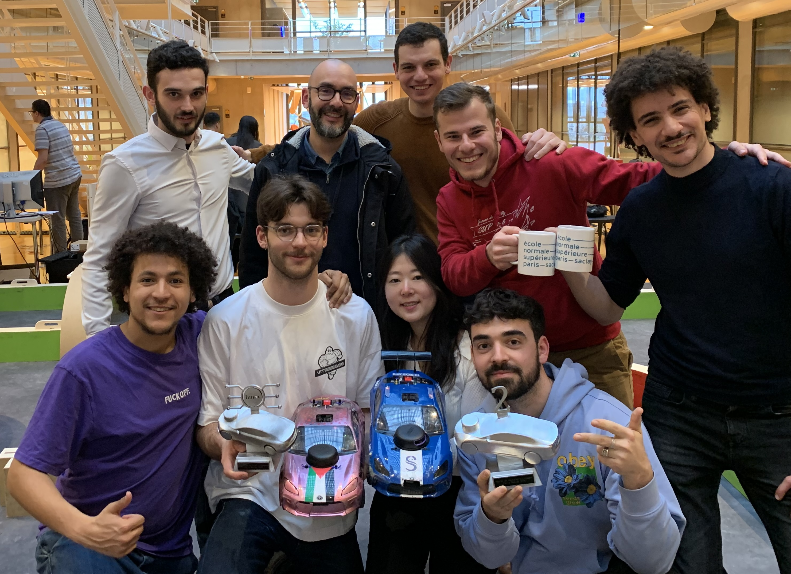
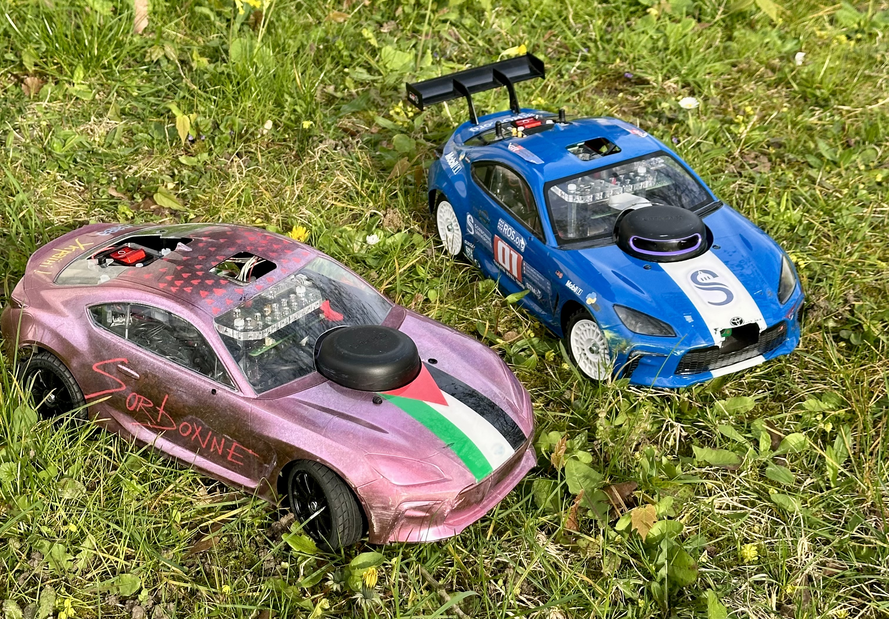

# Autonomous RC Car Race 2024

## Project Overview
This is a project made by Sorbonne University students. The goal is to make autonomous RC cars that can drive around a track and avoid obstacles for the ENS organized CoVAPSy (*Course Voiture Autonome Paris Saclay*) race.

We entered two cars in the 2024 race, both using two different navigation heuristics. The hardware is pretty much identical between the two cars, but one of them uses a Dynamixel instead of a standard Servo for steering control. 

The project is divided into five main parts:
- **ROS packages for the first car (Reactive)** [course_2024_pkgs](https://github.com/SorbonneUniversityBolideContributors/course_2024_pkgs)
- **ROS packages for the second car (SLAM)** [course_2024_pkgs](https://github.com/SorbonneUniversityBolideContributors/course_2024_pkgs)
- **Bolide scripts** [bolide_scripts](bolide_scripts/) contains scripts for specific implementations on the vehicle
- **Documentation** [documentation](documentation/) contains some basic documentation for the project
- **Simulation** [SimuWebots](SimuWebots/) contains the simulation of the bolide in Webots
- **STM32 code** [CoVAPSy_STM32](CoVAPSy_STM32/) contains the code for the STM32 microcontroller that link the car sensors to the Raspberry Pi

:-------------------------:|:-------------------------:

## ENS Race Overview
https://ajuton-ens.github.io/CourseVoituresAutonomesSaclay/

## Getting Started

Install ROS Noetic on your computer. Check the [ROS Noetic installation guide](http://wiki.ros.org/noetic/Installation/Ubuntu) for more information.

Check the [Robot_setup.md](documentation/Robot_setup.md) file to get started with the robot.

Bolide's IP when connected to the rooter (SSID=R15-AF66) at St-Cyr
- IP bolide2: 192.168.137.78
- IP bolide1: 192.168.137.165

Check the [ros_bashrc_lines.md](documentation/ros_bashrc_lines.md) file and copy ir to you're own `~/.bashrc`.
It'll save you a lot of trouble when connecting to the robots or interacting with the simulation or simply with ROS.
Make sure that there are no double declarations and that the ROS environement variables `ROS_NAMESPACE` and `ROS_MASTER_URI` are unset.

Then you are ready to clone the ROS packages and build them !

For further information about our ROS packages, check the [course_2024_pkgs](https://github.com/SorbonneUniversityBolideContributors/course_2024_pkgs) repository.
