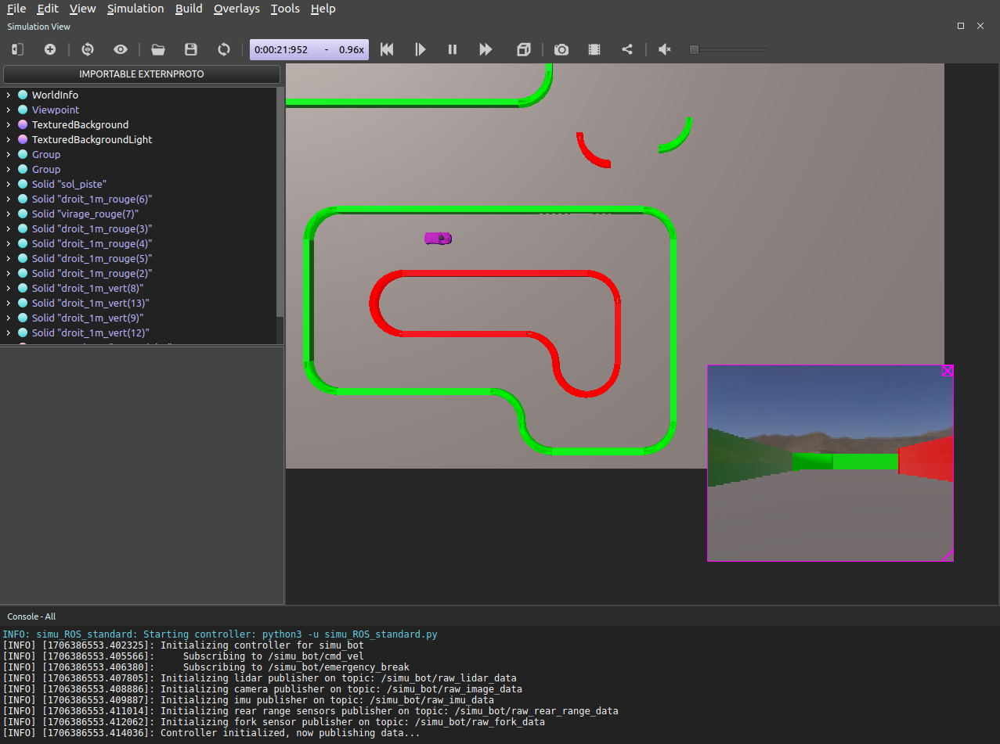
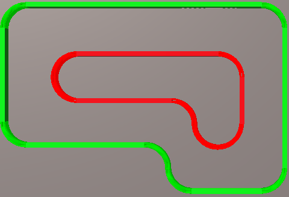

# Webots simulations for autonomous car racing

This folder contains the files you need to use the Webots simulator for autonomous car racing.
First of all, it's **imperative** to read the simulator installation and use tutorials, available in the [tutorials](tutorials/) folder.

The simulator is implemented so that the simulated robot is as close as possible to the real thing, whether in terms of electronic architecture (sensors), physical architecture (weight, inertia, etc.) or implementation (interfacing with ROS). The algorithms used to calculate the robot's trajectories must be easy to understand (comments, documentation, readable codes), light on CPU consumption and above all parameterizable (the robot's real physical environment may be very different from its simulated environment: the parameters used in the simulated algorithms will therefore have to evolve once in the real world).

Simulated vehicle | Example of simulation track
:-------------------------:|:-------------------------:
 | 

___

**Important note 1:** This simulator has been developed entirely under Linux, and has not been tested under Windows or MacOS. It is possible to install WeBots under these two OSes, but the use of ROS in these environments is less natural than under Linux. As I don't have access to a machine running Windows or MacOS, I can't provide instructions on how to install the simulator for these two OS.

**Important note 2:** To use this simulator, you need to master the basic concepts of ROS (reading and posting efficiently in ROS topics, using rosmaster and roslaunch, rosbag, rosmsg, timers, etc.). This document is written on the assumption that the reader has mastered these theoretical points. If this is not the case, please refer to the ROS documentation and the examples in the project's Google Drive.

## SimuWebots content

- [controllers](controllers/) : This folder contains the python codes executed by webots when a vehicle using the cited controller appears.
- [protos](protos/) : This folder contains the ``.proto`` files describing the 3D models of the objects used in the simulation worlds.
- [tutorials](tutorials/) : This folder contains tutorials for installing, using and modifying the simulator.
    - [tuto_installation.md](tutorials/tuto_installation.md) : This tutorial describes how to install the simulator.
    - [tuto_usage.md](tutorials/tuto_usage.md) : This tutorial describes how to use the simulator.
    - [tuto_modifying_robot.md](tutorials/tuto_modifying_robot.md) : This tutorial describes how to modify the 3D models used in the simulator.
    - [tuto_modifying_world.md](tutorials/tuto_modifying_world.md) : This tutorial describes how to modify the worlds used in the simulator.
    - [tuto_modifying_controller.md](tutorials/tuto_modifying_controller.md) : This tutorial describes how to modify the controllers used in the simulator.
- [worlds](worlds/) : This folder contains the ``.wbt`` files describing the simulation worlds used.

