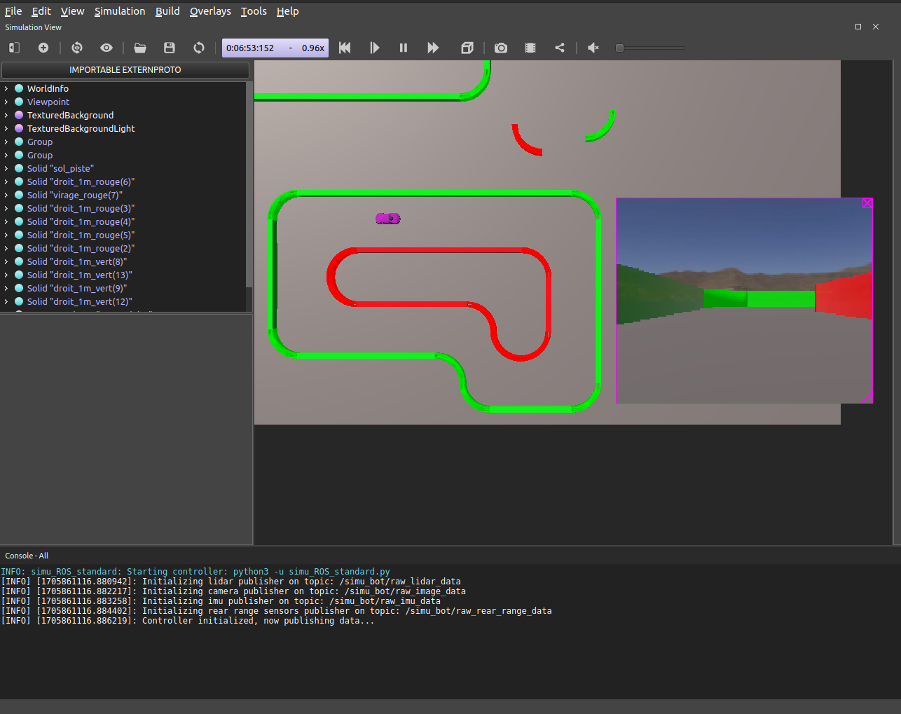

# Simulations Webots pour la course de voitures autonomes





Ce dossier contient les fichiers nécéssaires à l'utilisation du simulateur Webots pour la course de voitures autonomes.
Dans un premier temps, il est **impératif** de lire les tutoriels d'installation et d'utilisation simulateur, disponibles dans le dossier [tutorials](tutorials/).

Le simulateur est implémenté de sorte que le robot simulé soit le plus proche possible du robot réel, que ce soit en termes d'architecture électronique (capteurs), physique (poids, inertie...) ou d'implémentation (interfaçage avec ROS). Les algorithmes réalisés pour le calcul des trajectoire de ce robot devront être facilement compréhensibles (commentaires, documentation, codes lisibles), légers en consommation CPU et surtout paramétrables (l'environnement physique réel du robot pourra être bien différent de son environnement simulé : les paramètres utilisé dans les algorithmes simulé seront donc amenés à évoluer une fois dans le monde réel).


Véhicule simulé | Exemple de piste de simulation
:-------------------------:|:-------------------------:
 | 


**Note importante 1 :** Ce simulateur a été intégralement développé sous Linux, et n'a pas été testé sous Windows ou MacOS. Il est possible d'installer WeBots sous ces deux OS, mais l'utilisation de ROS dans ces environnements est moins naturelle que sous Linux. N'ayant pas accès à une machine équipée de Windows ou MacOS, je ne peux pas fournir d'instructions d'installation du simulateur pour ces deux OS.

**Note importante 2 :** L'utilisation de ce simulateur requiert de maîtriser les concepts de base de ROS (lecture et publication efficace dans des topics ROS, utilsation du rosmaster et de roslaunch, rosbag, rosmsg, timers ...). Ce document est rédigé en supposant que le lecteur maîtrise ces points théoriques. Si ce n'est pas le cas, se référer à la documentation de ROS et aux exemples proposés dans le Google Drive du projet.

## Contenu de SimuWebots

- [controllers](controllers/) : Ce dossier contient les codes pythons excécutés par webots lors de l'aparition d'un véhicule employant le controleur cité.
- [protos](protos/) : Ce dossier contient les fichiers ```.proto``` décrivant les modèles 3D des objets utilisés dans les mondes de simulation.
- [tutorials](tutorials/) : Ce dossier contient les tutoriels d'installation, d'utilisation et de modification du simulateur.
    - [tuto_installation.md](tutorials/tuto_installation.md) : Ce tutoriel décrit la procédure d'installation du simulateur.
    - [tuto_usage.md](tutorials/tuto_usage.md) : Ce tutoriel décrit la procédure d'utilisation du simulateur.
    - [tuto_modifying_robot.md](tutorials/tuto_modifying_robot.md) : Ce tutoriel décrit la procédure de modification des modèles 3D utilisés dans le simulateur.
    - [tuto_modifying_world.md](tutorials/tuto_modifying_world.md) : Ce tutoriel décrit la procédure de modification des mondes de simulation utilisés.
    - [tuto_modifying_controller.md](tutorials/tuto_modifying_controller.md) : Ce tutoriel décrit la procédure de modification du contrôleur du robot simulé.
- [worlds](worlds/) : Ce dossier contient les fichiers ```.wbt``` décrivant les mondes de simulation utilisés.

