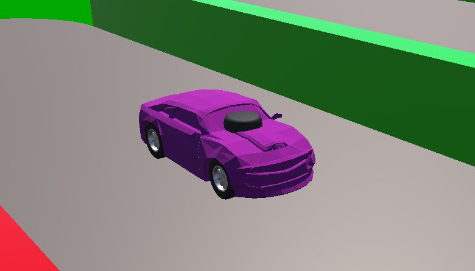
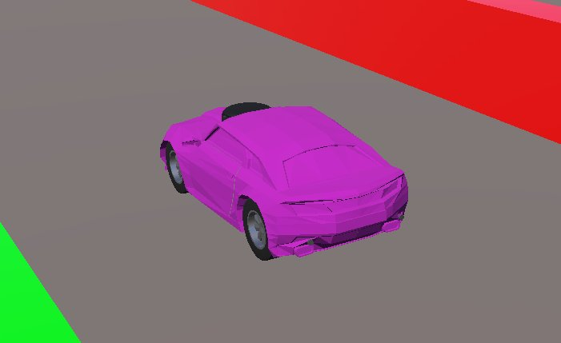

# Tutoriel : modifier un robot dans Webots

Ce tutoriel décrit la procédure de modification des modèles 3D utilisés dans le simulateur Webots.

Avant du véhicule          |  Arrière du véhicule
:-------------------------:|:-------------------------:
      |


## Description des fichiers véhicule

### Imports

Au début du script .proto, il faut importer les modules nécéssaires à la création du modèle 3D. Il est possible d'importer des modules externes, mais il est conseillé d'utiliser les modules fournis par Webots.

```proto
EXTERNPROTO "https://raw.githubusercontent.com/cyberbotics/webots/R2023b/projects/vehicles/protos/abstract/Car.proto"
EXTERNPROTO "TT02Wheel.proto"
EXTERNPROTO "https://raw.githubusercontent.com/cyberbotics/webots/R2023b/projects/devices/slamtec/protos/RpLidarA2.proto"
```

### Paramètres du véhicule

Il est possible de modifier les paramètres du véhicule simulé en modifiant les valeurs des variables définies dans le fichier .proto. Ces variables sont définies dans les parties ```field``` et ```Car``` du fichier .proto


```proto
PROTO TT02_2023b [
  field SFVec3f    translation     0 0 0.036               # Is `Transform.translation`.
  field SFRotation rotation        0 0 1 0                 # Is `Transform.rotation`.
  field SFString   name            "TT02_2023b"            # Is `Solid.name`.
  field SFString   controller      "<generic>"             # Is `Robot.controller`.
  field MFString   controllerArgs  []                      # Is `Robot.controllerArgs`.
  field SFString   window          "<generic>"             # Is `Robot.window`.
  field SFBool     synchronization TRUE                    # Is `Robot.synchronization`.
  field SFColor    color           0.69 0.0 1.0            # Is `Material.diffuseColor`.            
  field SFInt32    lidarHorizontalResolution 360           # Is `Lidar.HorizontalResolution`.
  field SFFloat    lidarMinRange             0.1           # Is `Lidar.minRange`.
  field SFFloat    lidarMaxRange             12.0          # Is `Lidar.maxRange`.
  field SFFloat    lidarNoise_OverMaxRange   0.000833      # Is `Lidar.noise`.
  field SFFloat    lidarResolution           0.01          # Is `Lidar.resolution`.
  field SFFloat    lidarDefaultFrequency     12            # Is `Lidar.defaultFrequency`.
]
{
  Car {
    translation IS translation
    rotation IS rotation
    name IS name
    model "TT02"
    controller IS controller
    controllerArgs IS controllerArgs
    window IS window
    synchronization IS synchronization
    trackFront                     0.15
    trackRear                      0.15
    wheelbase                      0.257
    minSteeringAngle               -0.40
    maxSteeringAngle               0.40
    suspensionFrontSpringConstant  100000
    suspensionFrontDampingConstant 4000
    suspensionRearSpringConstant   100000
    suspensionRearDampingConstant  4000
    wheelsDampingConstant          5
    wheelFrontRight                TT02Wheel { name "front right wheel" }
    wheelFrontLeft                 TT02Wheel { name "front left wheel"}
    wheelRearRight                 TT02Wheel { name "rear right wheel"}
    wheelRearLeft                  TT02Wheel { name "rear left wheel"}
    type                    "4x4"
    engineType              "electric"
    engineSound             ""
    brakeCoefficient        700
    time0To100              10
    engineMaxTorque         0.0234
    engineMaxPower          32
    engineMinRPM            1
    engineMaxRPM            13800
    gearRatio               [-0.62 0.62]
    maxVelocity             36
    ...
  }
}
```

### Capteurs

Il est possible d'ajouter des capteurs au véhicule simulé en ajoutant des lignes dans la partie ```extensionSlot``` de ```Car```. Il faut alors ce référer à la documentation de Webots pour connaître les paramètres nécéssaires à l'ajout de ce capteur. (voir https://cyberbotics.com/doc/guide/sensors)

```proto
...
    extensionSlot [
      Emitter {
      }
      Speaker {
        name "TT02_speaker"
        translation 0.257 0 0
      }
      Accelerometer {
        name "TT02_accelerometer"
        xAxis TRUE
        yAxis TRUE
        zAxis TRUE
      }
      Gyro {
        name "TT02_gyro"
        xAxis TRUE
        yAxis TRUE
        zAxis TRUE
      }
      Camera {
        name "TT02_camera"
      	translation 0.30 0 0.04
      	rotation 0.0 0.0 0.0 0.0
      	width 160
      	height 128
	  }
      ...
    ]
...
```

### Forme associée à un capteur

Il est possible de modifier la forme associée à un capteur en modifiant la partie ```Shape``` ou ```Transform``` du capteur. Il faut alors ce référer à la documentation de Webots pour connaître les paramètres nécéssaires à la modification de la forme du capteur. (voir https://cyberbotics.com/doc/guide/sensors)

```proto
...
      DistanceSensor {
        name "TT02_IR_rear_left"
        translation -0.085 0.065 0.01
      	rotation 0 0 1 3.0116
        lookupTable [ 0.00 0.00 0.00,
                      0.05 0.05 0.010,
                      0.10 0.10 0.005,
                      0.12 0.12 0.003,
                      0.15 0.15 0.002,
                      0.20 0.20 0.004,
                      0.25 0.25 0.006,
                      0.30 0.30 0.009,
                      0.34 0.34 0.015 ]
        type "infra-red"
        children [
          DEF RANGESENSOR Transform {
            rotation 0.577197 0.577197 -0.577197 -2.093935
            children [
              Shape {
                appearance PBRAppearance {
                  baseColor 0.2 0.2 0.2
                  metalness 0
                  roughness 0.3
                }
                geometry Cylinder {
                  height 0.002
                  radius 0.0035
                }
              }
            ]
          }
        ]
      }
...
```