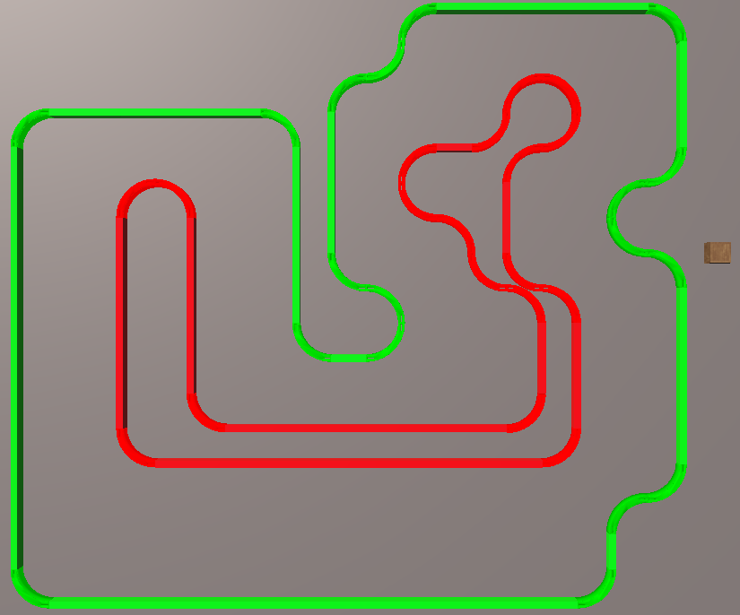
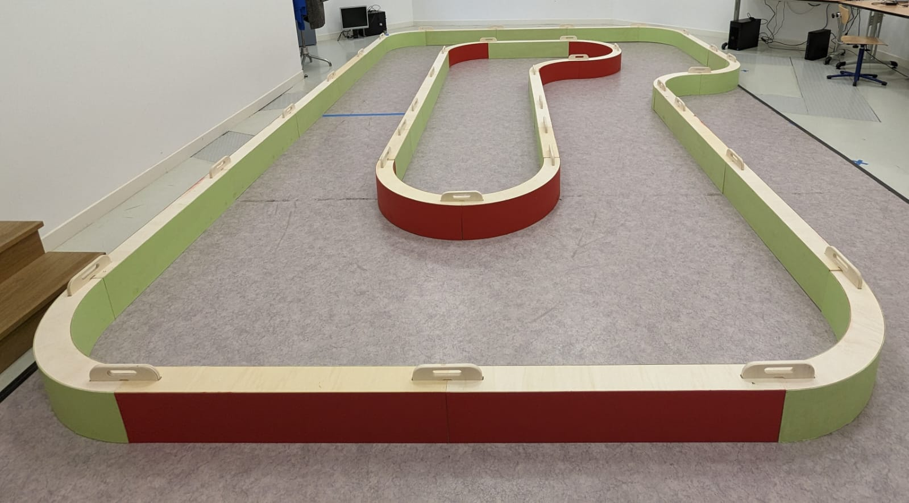

# Tutorial: Changing the Webots Simulation World

This tutorial aims to teach you how to modify the Webots simulation world to add objects, robots etc.

Piste 2023 ENS | Piste Saint-Cyr
:-------------------------:|:-------------------------:
      |


Real Saint-Cyr Track |
:-------------------------:



## Prerequisites

Have Webots installed on your computer (see [tuto_installation.md](tuto_installation.md) for more information).

## Simulation World Modification Procedure

### From the GUI

To move an object in the simulation world, simply select it in the tree view to the left of the graphical viewport or click it directly in the graphical viewport. Once the object is selected, it is possible to move it by clicking on the motion (arrows) or rotation (circles) axes.

Objects can be copied, pasted, deleted, duplicated, etc. using the GUI buttons or related keyboard shortcuts.

### From the file . wbt

It is also possible to modify the simulation world by modifying the associated ```.wbt``` file.

Here is an example of adding an obstacle in the simulation world:

```proto
WoodenBox {
  translation 5 1.5 0.146076898211959
  rotation 0.06339729635525808 0.13255798328830493 0.9891456737414268 2.630091579783722e-16
  size 0.3 0.3 0.3
  mass 10
}
```

It is possible to modify the parameters of the object (position, rotation, size, mass, etc.) by modifying the associated values.


## Tutorials

- [tuto_installation.md](tuto_installation.md) : This tutorial describes how to install the simulator.
- [tuto_usage.md](tuto_usage.md) : This tutorial describes how to use the simulator.
- [tuto_modifying_robot.md](tuto_modifying_robot.md) : This tutorial describes how to modify the 3D models used in the simulator.
- [tuto_modifying_world.md](tuto_modifying_world.md) : This tutorial describes how to modify the worlds used in the simulator.
- [tuto_modifying_controller.md](tuto_modifying_controller.md) : This tutorial describes how to modify the controllers used in the simulator.

[main_readme](../README.md)
