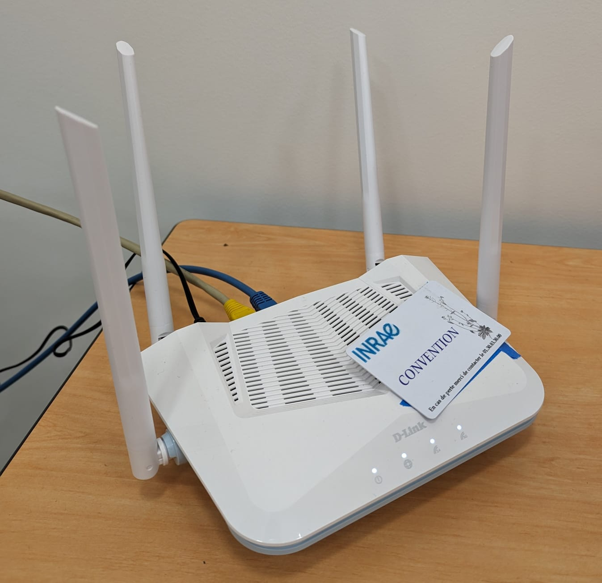

# Setting up the router at St-Cyr to have internet access

This file explain how to give internet access to the router at St-Cyr. Due the impossibility to connect the router to the internet via ethernet, we used another computer (with windows 10 and connected to the internet via wifi) to share its internet connection with the router.

If this configuration isn't possible anymore please contact someone at St-Cyr to find another way to connect the router via ethernet.

All the **password** are on the google drive in the `/PFE_2024/Identifiers` file

(All the words for the computer and router interface are in french because thei're in french)

## Connect the router to the computer

The computer needs to be connected to the router via an ethernet cable plugged in the port `"internet"` of the router (The yellow port).

## Setup the router

1. Connect another computer to the router's wifi (SSID: `R15-AF66`) the password is writed on and under the router.

2. Open a web browser and go to `http://af66.devicesetup.net` and connect to the admin interface with the password writed on the router.

3. Go to `Paramètres` > `Mode de fonctionnement` and select (If it's not already selected) `Mode pont` in the scroll down menu. Then, click on `Enregistrer`. This will reboot the router and the config will be done.

## Setup the windows 10 computer

1. Ensure that the computer is connected to internet via wifi (should already be connected to eduroam network).

2. Go to `Panneau de configuration` > `Réseau et Internet` > `Centre Réseau et partage` > `Modifier les paramètres de la carte`, right click on the wifi connection and select `Propriétés`. You'll find the admin password on the desktop of the computer, if not please ask Frederic at St-Cyr.

3. Go to the `Partage` tab and check the box `Autoriser d'autres utilisateurs du réseau à se connecter via la connexion Internet de cet ordinateur` then click on `OK`. The connection will be shared and the router will have internet access.

## Troubleshooting

If the router doesn't have internet access when rebooting the computer, please uncheck the box `Autoriser d'autres utilisateurs du réseau à se connecter via la connexion Internet de cet ordinateur` (from the step 3 above) click on `OK` and wait a few seconds. Then go back in the `Partage` tab and check the box again and click on `OK`. The router should have internet access now.